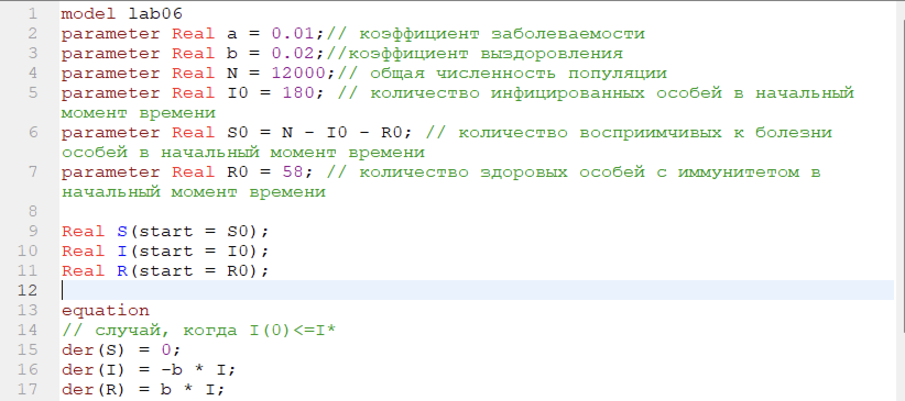
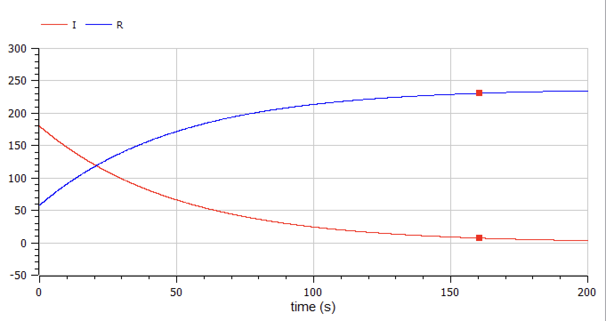
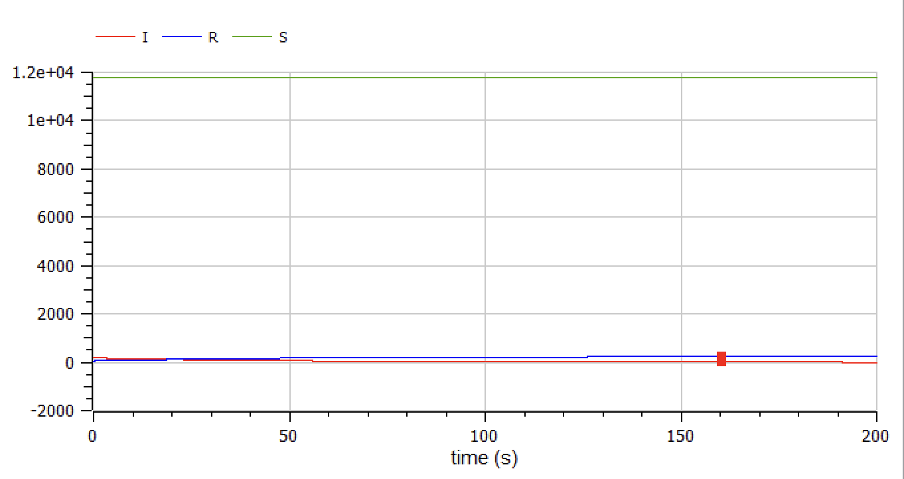
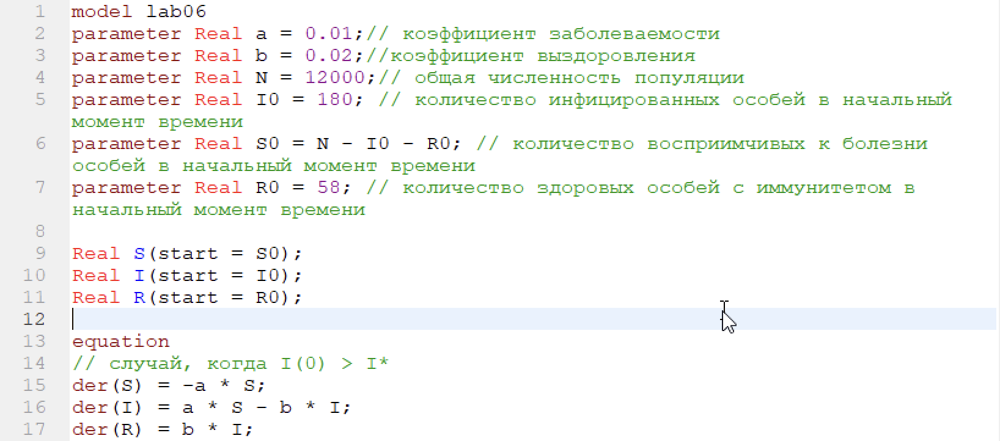
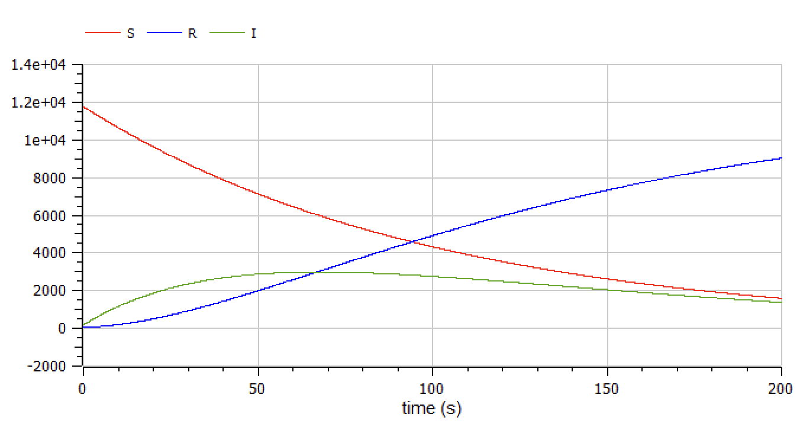

---
# Front matter
title: "Отчёт по лабораторной работе №6"  
subtitle: "Вариант 39"  
author: "Александр Олегович Воробьев"

# Generic otions
lang: ru-RU
toc-title: "Содержание"

# Pdf output format
toc: true # Table of contents
toc_depth: 2
lof: true # List of figures
lot: true # List of tables
fontsize: 12pt
linestretch: 1.5
papersize: a4
documentclass: scrreprt
## I18n
polyglossia-lang:
  name: russian
  options:
	- spelling=modern
	- babelshorthands=true
polyglossia-otherlangs:
  name: english
### Fonts
mainfont: PT Serif
romanfont: PT Serif
sansfont: PT Sans
monofont: PT Mono
mainfontoptions: Ligatures=TeX
romanfontoptions: Ligatures=TeX
sansfontoptions: Ligatures=TeX,Scale=MatchLowercase
monofontoptions: Scale=MatchLowercase,Scale=0.9
## Biblatex
biblatex: true
biblio-style: "gost-numeric"
biblatexoptions:
  - parentracker=true
  - backend=biber
  - hyperref=auto
  - language=auto
  - autolang=other*
  - citestyle=gost-numeric
## Misc options
indent: true
header-includes:
  - \linepenalty=10 # the penalty added to the badness of each line within a paragraph (no associated penalty node) Increasing the value makes tex try to have fewer lines in the paragraph.
  - \interlinepenalty=0 # value of the penalty (node) added after each line of a paragraph.
  - \hyphenpenalty=50 # the penalty for line breaking at an automatically inserted hyphen
  - \exhyphenpenalty=50 # the penalty for line breaking at an explicit hyphen
  - \binoppenalty=700 # the penalty for breaking a line at a binary operator
  - \relpenalty=500 # the penalty for breaking a line at a relation
  - \clubpenalty=150 # extra penalty for breaking after first line of a paragraph
  - \widowpenalty=150 # extra penalty for breaking before last line of a paragraph
  - \displaywidowpenalty=50 # extra penalty for breaking before last line before a display math
  - \brokenpenalty=100 # extra penalty for page breaking after a hyphenated line
  - \predisplaypenalty=10000 # penalty for breaking before a display
  - \postdisplaypenalty=0 # penalty for breaking after a display
  - \floatingpenalty = 20000 # penalty for splitting an insertion (can only be split footnote in standard LaTeX)
  - \raggedbottom # or \flushbottom
  - \usepackage{float} # keep figures where there are in the text
  - \floatplacement{figure}{H} # keep figures where there are in the text
---

# Цель работы

Изучить модель эпидемии, построить графики изменения численности трёх групп особей для двух случаев, относительно числа инфицированных особей.  

# Задание

Построить график зависимости численности трёх групп особей: восприимчивых к болезни, пока что здоровых, инфицированных, которые распространяют инфекцию и здоровые с иммунитетом к болезни для двух случаев, когда число инфицированных меньше критического значения и когда больше него.

# Теоретическое введение

Рассмотрим простейшую модель эпидемии. Предположим, что некая популяция, состоящая из $N$ особей, (считаем, что популяция изолирована) подразделяется на три группы. Первая группа - это восприимчивые к болезни, но пока здоровые особи, обозначим их через $S(t)$. Вторая группа – это число инфицированных особей, которые также при этом являются распространителями инфекции, обозначим их $I(t)$. А третья группа, обозначающаяся через $R(t)$ – это здоровые особи с иммунитетом к болезни.
До того, как число заболевших не превышает критического значения
$I^*$, считаем, что все больные изолированы и не заражают здоровых. Когда $I (t) > I^*$ ,
тогда инфицирование способны заражать восприимчивых к болезни особей.
Таким образом, скорость изменения числа $S(t)$ меняется по следующему
закону:  

$$ \frac{dS}{dt} = 
    \begin{cases}
        -\alpha S, \: если \: I (t) > I^*\\
        0, \: если I (t) <= I^*
    \end{cases}$$

Поскольку каждая восприимчивая к болезни особь, которая, в конце концов, заболевает, сама становится инфекционной, то скорость изменения числа инфекционных особей представляет разность за единицу времени между заразившимися и теми, кто уже болеет и лечится, т.е.:  

$$ \frac{dI}{dt} = 
    \begin{cases}
        \alpha S \: - \: \beta I, \: если \: I (t) > I^*\\
        -\beta I, \: если I (t) <= I^*
    \end{cases}$$

А скорость изменения выздоравливающих особей (при этом приобретающие иммунитет к болезни)  
$$ \frac{dR}{dt} = \beta I$$
Постоянные пропорциональности $\alpha, \beta$ - это коэффициенты заболеваемости и выздоровления соответственно.
Для того, чтобы решения соответствующих уравнений определялось однозначно, необходимо задать начальные условия .Считаем, что на начало эпидемии в момент времени $t = 0$ нет особей с иммунитетом к болезни $R(0)=0$, а число инфицированных и восприимчивых к болезни особей $I (0)$ и $S (0)$
соответственно.

# Выполнение лабораторной работы

**1. Пропишем программу для построения графика зависимости численности трёх групп особей, с условием, что $I (0) <= I^*$.** 

  Зададим исходные переменные и пропишем уровнения:

  { #fig:001 width=70% }  

  Запускаем модель для времени $0 < t < 200$, с шагом 0,01:

  { #fig:002 width=70% }  

  { #fig:003 width=70% }  

  Добавим к предыдущему соотношению число людей, воскприимчивых к заболеванию:  

  { #fig:004 width=70% }  

**2. Изменим программу для второго случая, где $I (t) > I^*$.**  

	Изменим уравнения:  

  { #fig:005 width=70% }  

	Запускаем модель для с теми же установками симуляции:  
    
  { #fig:006 width=70% }  
 
# Выводы

В ходе выполнения лабораторной работы я познакомился с моделью эпидимии, релизовал графики с соотношений различных групп особей для случаев, когда число заболевших меньше критического значения, и наоборот, когда оно превышает критическое значение.

# Список литературы{.unnumbered}

	1. Кулябов Д.С. Лабораторная работа №6. Модель хищник-жертва [Электронный ресурс] - 4 с. 
	2. Кулябов Д.С. Лабораторная работа №6. Варианты [Электронный ресурс] - 28 с. 

::: {#refs}
:::
